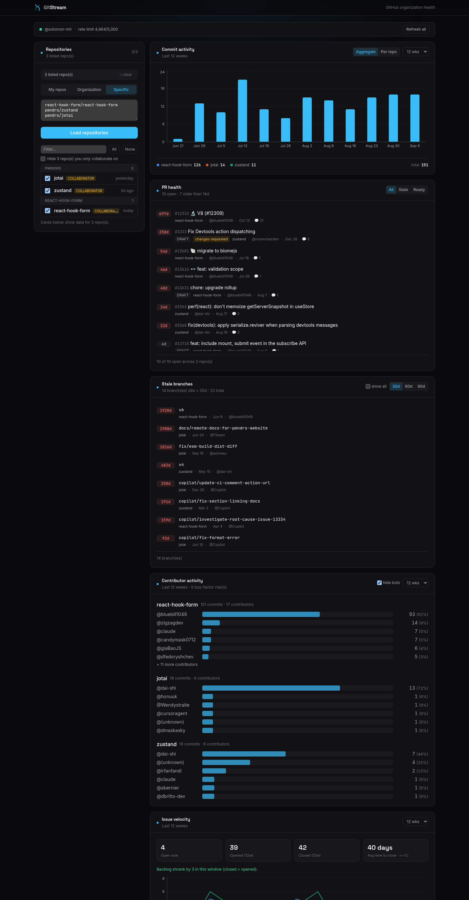

# GitStream

A single-page dashboard for GitHub **organization health**. It pulls commit
activity, PR age, stale branches, contributor concentration and issue velocity
into one screen, so you can tell how your repos are doing without clicking
through a dozen GitHub tabs.

**Brand:** the mark is two git branches weaving past each other — a braided
current — with a commit node where they cross. "Git" (branch lanes + commit dot)
and "stream" (the flowing weave) in one glyph. Type: Space Grotesk for the
wordmark and headings, Inter for UI, JetBrains Mono for anything numeric.
Sky-cyan accent — the stream. Dark by default.



## Stack

| | |
|---|---|
| Framework | Next.js 16 (App Router) + TypeScript |
| Styling | Tailwind CSS, semantic colour tokens, **dark by default** |
| Charts | Recharts 3 |
| Data | GitHub **GraphQL v4** (REST only for the stats endpoints GraphQL doesn't expose) |
| Auth | A GitHub Personal Access Token, read **server-side only** from `GITHUB_TOKEN` |
| Caching | In-memory TTL cache in the Node process, so repeated loads don't re-hit the API |

---

## Setup

### 1. Install

```bash
npm install
```

### 2. Create a GitHub Personal Access Token

**Classic token — recommended for a multi-org dashboard:**

1. GitHub → Settings → Developer settings → Personal access tokens → **Tokens (classic)** → *Generate new token (classic)*
2. Select scopes:
   | Scope | Why |
   |---|---|
   | `repo` | Read **private** repositories, their PRs, branches, issues. Omit only if you track public repos exclusively. |
   | `read:org` | List an organization's repositories, and populate the org quick-picks. |
3. Generate and copy the `ghp_…` value.

One classic token spans **everything your account can access** — all your orgs,
all your private repos.

**Fine-grained token** (more locked down, but limited): a fine-grained token is
tied to **one owner** (your user *or* a single org) chosen at creation — it can
**never** span multiple orgs. Grant it repository access + these read-only
permissions: *Metadata*, *Contents*, *Pull requests*, *Issues*. For an org
dashboard, create the token **under that org**. For several orgs, use a classic
token instead.

> GitStream never hides repos by visibility — private repos appear whenever the
> token can read them. If they're missing, the status bar tells you which
> scope/permission is the reason.

### 3. Configure the environment

```bash
cp .env.example .env.local
```

Edit `.env.local`:

```bash
GITHUB_TOKEN=ghp_your_real_token_here
# optional — org to auto-load when the dashboard opens
NEXT_PUBLIC_DEFAULT_ORG=your-org
```

`.env.local` is git-ignored. **Never put a real token in `.env.example`** — that
file is committed. The token is only read in server-side Route Handlers
(`src/app/api/**`) and is never sent to the browser.

### 4. Run

```bash
npm run dev          # http://localhost:3000
```

Other scripts:

```bash
npm run build        # production build
npm start            # run the production build
npm run typecheck    # tsc --noEmit
```

### 5. Verify it works

Open <http://localhost:3000>. The status bar at the top should show
`@your-username` and your rate-limit budget. Or hit the endpoint directly:

```bash
curl -s localhost:3000/api/verify | jq
```

Pick a source in the **Repositories** panel:

| Mode | What it loads |
|---|---|
| **My repos** (default) | Every repo your token can see — personal, collaborations, and every org you belong to. Grouped by owner. |
| **Organization** | Every repo in one org. Orgs your token can see are offered as one-click chips (needs `read:org`). |
| **Specific** | An explicit list of `owner/name` lines. |

The active source shows as a chip with an **✕ clear** button — that's how you
reset it (it's also remembered across reloads, so clearing is the way out).

Deep-link a view:

```
/?mine=1
/?org=vercel&weeks=26&staleDays=60
/?repos=vercel/next.js,facebook/react
```

> Loading a big "My repos" list auto-selects only the 12 most recently pushed
> repos (each card makes one API call per selected repo). Tick more as needed.

---

## What each card shows

| Card | Data | Notes |
|---|---|---|
| **Commit activity** | Commits per week, per repo + aggregate, over 4–52 weeks | From REST `stats/commit_activity`. Aggregate = bar chart, per-repo = line chart (top 7 repos, rest folded into "Other"). |
| **PR health** | Every open PR, oldest first | PRs older than **14 days** get a red badge (7–14d amber). Draft / approved / changes-requested tags. Filter: All / Stale / Ready. Fetches the oldest 50 PRs per repo. |
| **Stale branches** | Branches with no commits in **30 / 60 / 90 days** (toggle) | Shows last-commit date + author. Default branch is listed but greyed and never counted as "stale". Fetches the 100 stalest branches per repo. |
| **Contributor activity** | Commits per contributor in the window, as a share of the repo | Repos where one person authored **> 80%** (with ≥ 10 commits) are flagged as a **bus-factor risk**. Bots (`*[bot]`, `actions-user`, …) are hidden by default — toggle "hide bots" off to include them. |
| **Issue velocity** | Opened vs. closed issues per week + average time-to-close | Totals are exact; the weekly chart and the average use the 100 most-recent issues per direction (flagged when a repo exceeds that). "Open now" is the current backlog. |

Every card follows the **selected repos** and the shared **time window**. Loading,
empty and error states are handled per card — you never get a blank space.

---

## Project layout

```
src/
  app/
    api/
      verify/route.ts            GET  — token / auth check + rate limit
      repos/route.ts             GET  — repo list (?org= or ?repos=)
      commit-activity/route.ts   GET  — weekly commit counts
      pull-requests/route.ts     GET  — open PRs, oldest-first
      branches/route.ts          GET  — branches, stalest-first
      contributors/route.ts      GET  — contributor shares + bus factor
      issues/route.ts            GET  — opened/closed per week + time-to-close
      cache/clear/route.ts       POST — drop the in-memory cache ("Refresh all")
    layout.tsx  page.tsx  error.tsx  not-found.tsx

  components/
    dashboard/
      Dashboard.tsx              shell: status bar + selector + card grid
      DashboardContext.tsx       shared state (source, selection, window, refresh)
      StatusBar.tsx              auth identity, rate limit, "Refresh all", setup banner
      RepoSelector.tsx           org / repo-list input + checkable repo list
      useCardData.ts             shared fetch lifecycle for cards
      cards/                     one component per metric card
    ui/                          Card shell + Loading/Empty/Error/Skeleton states

  app/globals.css              theme tokens (dark :root, light :root.light)

  lib/
    api/
      client.ts                 browser fetch helper + describeError()
      respond.ts                route wrapper -> uniform { error: { kind, message } }
    github/
      client.ts                 GraphQL + REST transport, auth, typed errors
      cache.ts                  in-memory TTL cache + request de-duplication
      errors.ts                 GitHubApiError, kind -> HTTP status
      paginate.ts               generic Relay-cursor pagination
      types.ts                  normalised data shapes
      queries/                  one file per query (verify, repos, commitActivity, …)
    chart.ts                    shared Recharts palette + axis config
    format.ts                   date / number / duration helpers
```

## Data flow

```
React card ──apiGet()──▶ /api/<card> route handler
                              │
                        handleRoute()  ── catches GitHubApiError → JSON error
                              │
                        cached(key, fn, ttl)   ◀── in-memory cache (5–10 min)
                              │  (miss)
                        graphqlRequest() / restRequest()  ──▶  api.github.com
                              │
                        typed GitHubApiError on any failure
                              ▼
              { error: { kind, message } }  ──▶  describeError() in the card
```

- **One GraphQL request per card** where possible: multi-repo cards use aliased
  `repository(...)` fields so N repos cost one round-trip, not N.
- **Pagination** is handled: repo lists page through every cursor; the high-volume
  cards (PRs, branches, issues) fetch a bounded newest/oldest slice and report
  exact totals separately, with a visible "truncated" note.

## Caching & rate limits

GitHub gives you 5,000 GraphQL points/hour. GitStream keeps well under that:

- Every query result is cached in-memory (`src/lib/github/cache.ts`) for 3–10
  minutes depending on how fast the data moves (PRs: 3 min, branches: 10 min).
- Concurrent identical requests share one in-flight promise (no thundering herd
  on a cold cache).
- **Refresh all** (`POST /api/cache/clear`) drops the cache so a manual refresh
  really does re-hit GitHub.
- The status bar shows your remaining budget and turns amber under 10%.

The cache is per-process and non-durable — fine for a single-user dashboard.
For a multi-instance deployment, swap `cache.ts` for Redis or `unstable_cache`.

## Error handling

Every failure surfaces as a visible message, never a silent failure or a crash:

| Situation | `kind` | HTTP | UI |
|---|---|---|---|
| `GITHUB_TOKEN` unset | `MISSING_TOKEN` | 401 | Full-width setup banner |
| Token expired / wrong scopes | `BAD_CREDENTIALS` | 401 | Full-width setup banner |
| Primary/secondary rate limit | `RATE_LIMITED` | 429 | Card error w/ reset time |
| Org / repo not found | `NOT_FOUND` | 404 | Card error ("check the name") |
| Query too expensive (GitHub 502) | `NETWORK` | 502 | "select fewer repos" |
| GraphQL query error | `GRAPHQL` | 500 | Card error w/ message |
| Render/runtime bug | — | — | `app/error.tsx` boundary |

## Troubleshooting

| Symptom | Fix |
|---|---|
| Setup banner: "token not working" | Check `.env.local` has `GITHUB_TOKEN=`, the token isn't expired, and it has `repo` + `read:org`. Restart `npm run dev` after editing env. |
| Org not found / no org chips shown | The token can't see that org — it's missing the `read:org` scope (classic) or org access (fine-grained). Regenerate with `read:org`. |
| Wrong source stuck after reload | The source is saved to localStorage. Use the **✕ clear** button on the source chip. |
| "still computing stats" on commit/contributor cards | GitHub computes those async on first request for a repo. Wait ~10s and hit **Refresh all**. |
| PR / issue counts look huge | Public repos with lots of drive-by PRs/issues. The totals are exact; the sampled parts are flagged. |
| Rate limit hit | Wait for the reset shown in the status bar, or select fewer repos. Caching means normal use won't get close. |
